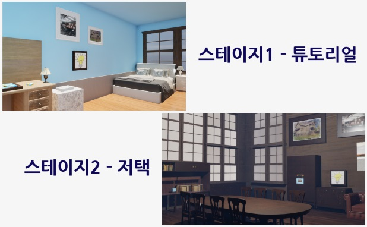
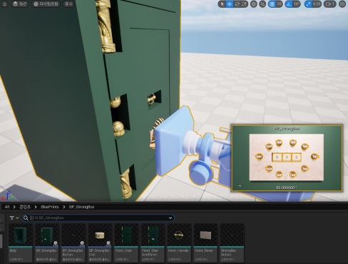
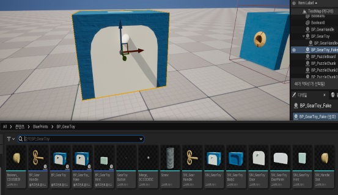
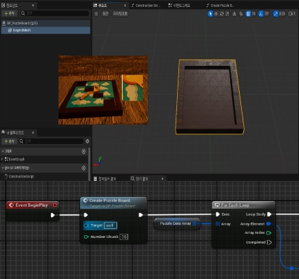
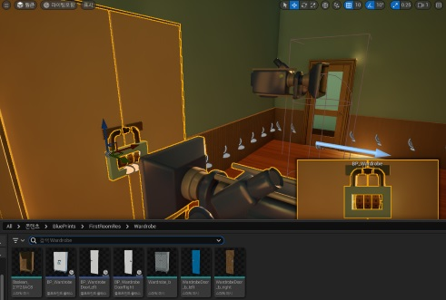
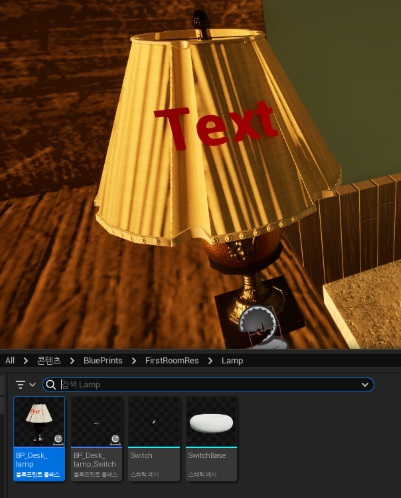
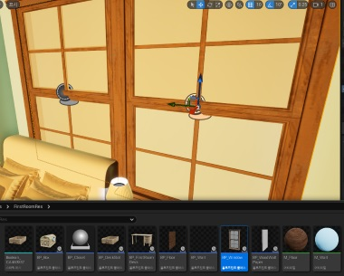
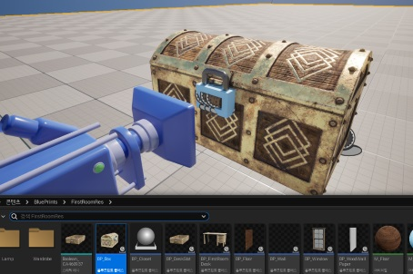
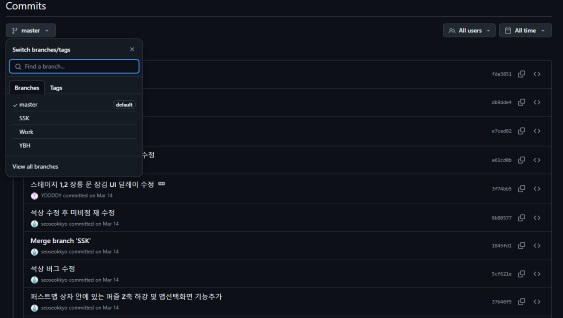

<!-- #  Jekyll Theme - BlogFolio

A simple and easy to use blog and portfolio theme for Jekyll

##  Install
1. Clone or download `https://github.com/lamccloskey/jekyll-theme-blogfolio.git`
2. Enter folder `cd jekyll-theme-blogfolio/`
3. Start Jekyll Server `jekyll serve`
4. Enter url `localhost:4000/jekyll-theme-blogfolio/`

##  Demo
[https://lamccloskey.github.io/jekyll-theme-blogfolio/](https://lamccloskey.github.io/jekyll-theme-blogfolio/)

##  Preview

---
_Powered by [Jekyll](http://jekyllrb.com/) and styled using [Bulma](http://bulma.io/)_ -->

# 프로젝트 이름

   
  
   

목차

1. 프로젝트 개요
2. 진행한 작업
3. 느낀점

## 1. 프로젝트 소개

<table>
  <tr>
    <td style="width: 30%; vertical-align: top;">
      
    </td>
    <td style="width: 70%; vertical-align: top; text-align: left;">
      <h3>프로젝트 개요/동기</h3>
      <ul>
        <li>언리얼엔진에서 플레이어의 상호작용을 중점으로 학습하기 위한 프로젝트</li>
        <li>Escape Simulator을 레퍼런스로 2개 스테이지 모작 진행</li>
        <li>3주간 2인으로 진행</li>
        <li>블루프린트만 사용</li>
      </ul>
    </td>
  </tr>
</table>

## 기술 스택

|	GitHub	|UnrealEngine|
| :------: 	| 	:------: |
| ![github]	| 	![ue]	 |

 

## 2. 진행한 작업

첫 계획은 각자 하나의 스테이지를 제작하려 하였으나 프로젝트 팀원 둘 다 언리얼을 처음 만져보는 단계여서 생각보다 기초작업이 딜레이가 되었고, 작업 중간중간 계속 소통이 필요하다 생각되어 완성까지 남은 작업을 리스트업 해놓고 손이 닿는대로 진행을 하되 진행관련을 소통하며 진행하게 됨

주로 제가 진행한 작업은 다음과 같습니다.
깃허브 관리
플레이어 기능 작성
필요한 퍼즐 에셋 및 기능 작성
디버깅

이번 프로젝트에서는 특기할만한 코드작업은 없다 생각하여 회고하는 느낌으로 작성하였습니다.

### 2-1. 금고 에셋 및 기능 제작
<table>
  <tr>
    <td style="width: 30%; vertical-align: top;">
      
    </td>
    <td style="width: 70%; vertical-align: top; text-align: left;">
      <ul>
        <li>실제 게임에 있는 금고의 느낌을 살려서 제작한 에셋</li>
        <li>3자리 비밀번호를 입력하고, 입력한 비밀번호가 맞는 번호일 경우 정면 중앙의 핸들이 돌아가며 금고가 열리는 퍼즐</li>
      </ul>
    </td>
  </tr>
</table>

### 2-2. 태엽상자 에셋 및 기능 제작
<table>
  <tr>
    <td style="width: 30%; vertical-align: top;">
      
    </td>
    <td style="width: 70%; vertical-align: top; text-align: left;">
      <ul>
        <li>실제 게임에 있는 태엽상자의 느낌을 살려서 제작한  에셋</li>
        <li>양쪽에 문이 있으며 스테이지내에서 기어를 하나 획득한 뒤 한쪽 문을 열 수 있고 거기에 있는 기어를 상자에 꽂으면 버튼이 있는 반대편 문이 열리게 되는 퍼즐</li>
	<li>모든 기어를 태엽상자에 꽂게되면 상자의 상단에서 다음퍼즐의 힌트가 나오는 구조</li>
      </ul>
    </td>
  </tr>
</table>

### 2-3. 퍼즐보드 에셋 및 기능 제작
<table>
  <tr>
    <td style="width: 30%; vertical-align: top;">
      
    </td>
    <td style="width: 70%; vertical-align: top; text-align: left;">
      <ul>
        <li>실제 게임에 있는 퍼즐처럼 각 퍼즐들의 모양이 불규칙적으로 만들지는 못하였으나 블루프린트로 구조체 작성 및 배열관리, 액터 동적생성등을 시도해봤던 퍼즐</li>
        <li>맵의 여기저기에 비어있는 4개의 홈에 맞는 퍼즐들이 뿌려지게 되며 모든 퍼즐을 수집하여 완성하게되면 스테이지를 클리어하고 나갈 수 있는 열쇠가 스폰</li>
      </ul>
    </td>
  </tr>
</table>

### 2-4. 그 외 제작 에셋들
<table>
  <tr>
    <td style="width: 30%; vertical-align: top;">
      
    </td>
    <td style="width: 70%; vertical-align: top; text-align: left;">
      <ul>
        <li>스테이지에 있는 힌트 종이를 확인한 뒤 다이얼을 맞추면 내부에 상자가 있는 액터</li>
      </ul>
    </td>
  </tr>
</table>
<table>
  <tr>
    <td style="width: 30%; vertical-align: top;">
      
    </td>
    <td style="width: 70%; vertical-align: top; text-align: left;">
      <ul>
        <li>램프의 전원을 키면 TEXT부분에 힌트 숫자가 나오는 액터</li>
      </ul>
    </td>
  </tr>
</table>
<table>
  <tr>
    <td style="width: 30%; vertical-align: top;">
      
    </td>
    <td style="width: 70%; vertical-align: top; text-align: left;">
      <ul>
        <li>창문을 열면 그 앞에 퍼즐 또는 힌트가 있을걸 구상하고 만들었으나 창문의 역할만 하게 된 액터</li>
      </ul>
    </td>
  </tr>
</table>
<table>
  <tr>
    <td style="width: 30%; vertical-align: top;">
      
    </td>
    <td style="width: 70%; vertical-align: top; text-align: left;">
      <ul>
        <li>스테이지에 있는 힌트를 확인한 뒤 다이얼을 맞추면 상자가 열리는 액터</li>
      </ul>
    </td>
  </tr>
</table>

### 2-5. 깃 관리
<table>
  <tr>
    <td style="width: 30%; vertical-align: top;">
      
    </td>
    <td style="width: 70%; vertical-align: top; text-align: left;">
      <ul>
        <li>선호하는 깃 관리방식인 Release/Work(최신)/Worker1/Worker2....방식으로 관리를 하였으며 기존에는 깃을 사용할 때 로컬로만 사용하여 깃허브는 처음 사용을 하게 됨</li>
        <li>사용법이 다른부분은 전혀 없었으나 Git Bash의 커맨드창이 아닌 GUI가있는 Git을 처음 사용하며 익숙해지게 됨</li>
		<li>Git Bash에서 자주 사용하던 특정 기능들은 GitHub Desktop에는 없거나 못찾아서 두개를 잘 혼용하면 이전보다 더욱 편하게 Git을 사용할 수 있음을 알게됨</li>
		<li>블루프린트 기반 프로젝트는 버전관리가 상당히 어려움이 있다는것을 알게됨</li>
      </ul>
    </td>
  </tr>
</table>

 

## 3. 느낀점

그동안 보통 2D데이터 위주로 접하였던게 게임엔진에서 큰 도움이 될까라는 생각이었는데 확실히 도움이 되는것을 알게됨

블루프린트로 배열데이터를 관리하려 하면 4x4배열[실제 코드는 1차원배열을 쪼개서 사용]의 데이터라도 노드가 상당히 복잡해지는것을 경험

각 물체들이 어떤 동작을 할 지 생각하고 에셋을 만들면 코드작업이 편해진다. (게임 개발을 처음 시작하면서 하나의 물체 외형을 만들 때 모션이 들어가는 모든 부분은 사실 서로 다른 매쉬를 이어붙인것이라는것을 처음 알게 됨)

게임에서 상호작용을 하는 기능이 아무리 잘 만들어졌어도 좋은 UX가 동반되지 않으면 애매하게 느껴진다는것을 직접 인터렉션기능 작업을 하며 깨닫게 됨

나도 게임개발에 입문은 할 수 있는 수준은 왔구나 하는것을 체감함

 

## 라이센스

MIT &copy; [NoHack](mailto:lbjp114@gmail.com)

<!-- Stack Icon Refernces -->

[git]: /images/stack/Git.svg
[github]: /images/stack/GithubDesktop.svg
[ue]: /images/stack/UnrealEngine.svg
